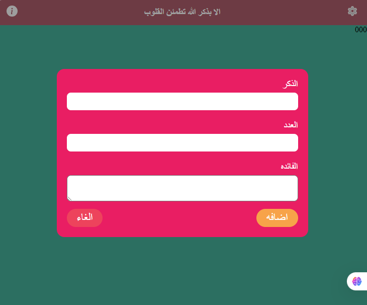

## 🧿 Misb7a App — Built with React
misbha App is a modern digital alternative to the traditional prayer bead counter, designed to help users engage in daily remembrance (dhikr) with ease, focus, and elegance. Developed using React, the app delivers a smooth, responsive, and intuitive experience across devices.

## 🔧 Key Features
- Interactive Tasbeeh Counter: Tap to increment counts for each recitation, with customizable targets and reset options.

- Preloaded Dhikr List: Includes popular phrases such as SubhanAllah, Alhamdulillah, and Allahu Akbar, with the ability to add custom entries.

- Progress Tracking: Visual indicators and session history help users monitor their spiritual progress over time.

- Responsive Design: Fully optimized for mobile and desktop devices, ensuring smooth performance across platforms.

- Lightweight & Fast: Built with React for high responsiveness and minimal load times.

## ⚙️ Technical Highlights
- ##### Component-Based Architecture:
  Built with reusable React components for maintainability and scalability.

- ##### Real-Time State Management:
  Utilizes React hooks like useState and useEffect to update the counter instantly and efficiently.

- ##### Responsive Design:
  Optimized for mobile and tablet use, ensuring seamless interaction on any screen size.

- ##### Local Storage Integration:
  Saves user preferences and progress, allowing continuity even after closing the app.

 ## 🕌 Core Features
- ✅ Interactive Dhikr Counter: Tap to increment the count with optional sound or vibration feedback.

- ✅ Customizable Phrases: Choose from common dhikr phrases like SubhanAllah, Alhamdulillah, Allahu Akbar, or add your own.

- ✅ Reset & History Tracking: Easily reset the counter and view daily or weekly progress.

- ✅ Minimalist UI: Clean and distraction-free interface to enhance spiritual focus.

## 🎯 Purpose & Vision
The Tasbeeh App bridges tradition and technology, empowering users to maintain their spiritual practices wherever they are. Whether during commutes, breaks, or quiet moments, the app serves as a thoughtful companion for reflection and remembrance.

